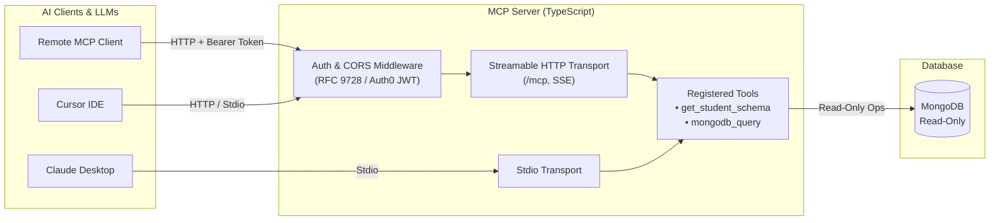

# MongoDB Read-Only MCP Server (`mcp-db-direct`)

A secure, enterprise-ready [Model Context Protocol (MCP)](https://modelcontextprotocol.io/) server built with TypeScript that exposes read-only MongoDB queries and schema introspection to AI assistants and LLM agents.

Supports both **Stdio** (local execution) and **Streamable HTTP / SSE** transports with **OAuth 2.0 (Auth0)** protection and an environment-based authentication bypass for flexible development.

---

## 📑 Table of Contents

- [Features](#-features)
- [Architecture](#-architecture)
- [Project Structure](#-project-structure)
- [Prerequisites](#-prerequisites)
- [Quick Start](#-quick-start)
- [Environment Configuration](#-environment-configuration)
- [Authentication & Security](#-authentication--security)
  - [OAuth 2.0 (Auth0)](#oauth-20-auth0)
  - [Toggling Authentication](#toggling-authentication)
- [MCP Tools Reference](#-mcp-tools-reference)
  - [`get_student_schema`](#1-get_student_schema)
  - [`mongodb_query`](#2-mongodb_query)
- [HTTP Endpoints & Discovery](#-http-endpoints--discovery)
- [Connecting MCP Clients](#-connecting-mcp-clients)
  - [Claude Desktop (Stdio)](#claude-desktop-stdio)
  - [Remote HTTP / SSE Clients](#remote-http--sse-clients)
- [Development & Testing](#-development--testing)
- [License](#-license)

---

## ✨ Features

- 🔒 **Read-Only Safety**: Strictly enforces non-mutating database operations (`find`, `findOne`, `aggregate`, `countDocuments`, `distinct`).
- 🚀 **Dual Transport Options**:
  - **Stdio Transport**: Seamless local integration with Claude Desktop, Cursor, and CLI agents.
  - **Streamable HTTP / SSE Transport**: Scalable Express server supporting streaming JSON-RPC sessions over HTTP.
- 🛡️ **OAuth 2.0 & RFC Compliance**:
  - Auth0 JWT token verification via `express-oauth2-jwt-bearer`.
  - **RFC 9728** Protected Resource Metadata (`/.well-known/oauth-protected-resource`).
  - **RFC 8414** OAuth Authorization Server discovery proxies.
- 🎛️ **Zero-Friction Dev Mode**: Easily toggle OAuth enforcement on (`ENABLE_OAUTH=1`) or off (`ENABLE_OAUTH=0`) via `.env`.
- 📊 **Intelligent Schema Introspection**: Provides rich collection models and business domain rules to AI models for accurate query generation.
- 🔄 **Safe BSON Serialization**: Automatically handles MongoDB `ObjectId`, `Date`, and special BSON types during JSON serialization.

---

## 🏗️ Architecture



---

## 📁 Project Structure

```text
mcp-direct-master/
├── src/
│   ├── db/
│   │   ├── mongodb.ts             # MongoDB client connection pool
│   │   └── serialize.ts           # BSON / ObjectId JSON serializer
│   ├── middleware/
│   │   └── middleware.ts          # Auth0 JWT validation & URL resolver
│   ├── models/
│   │   ├── student-schema.ts      # Database schema definitions
│   │   └── student-collections.ts # Collection metadata
│   ├── tools/
│   │   ├── query.ts               # Read-only query execution tool
│   │   ├── query-schema.ts        # Zod input validation schemas
│   │   └── schema.ts              # Schema introspection tool
│   ├── http.ts                    # Streamable HTTP / SSE Express server
│   ├── index.ts                   # Stdio transport entry point
│   └── test-auth.ts               # Auth0 token acquisition & endpoint test
├── .env                           # Environment configuration
├── package.json                   # Project scripts and dependencies
├── tsconfig.json                  # TypeScript compiler configuration
└── README.md                      # Project documentation
```

---

## 📋 Prerequisites

- **Node.js**: `v18.0.0` or higher
- **MongoDB**: `v5.0` or higher (local instance or MongoDB Atlas)
- *(Optional)* **Auth0 Account**: If enabling OAuth 2.0 authorization

---

## 🚀 Quick Start

### 1. Clone & Install Dependencies

```bash
git clone <repository-url>
cd mcp-direct-master
npm install
```

### 2. Configure Environment Variables

Create or update `.env` in the project root:

```env
# MongoDB Connection
MONGODB_URI=mongodb://localhost:27017
MONGODB_DATABASE=results-analyzer

# Server Port & Public URL
PORT=3000
MCP_PUBLIC_URL=http://localhost:3000

# Authentication Mode (1 = Enabled, 0 = Disabled)
ENABLE_OAUTH=0

# Auth0 Configuration (Required only if ENABLE_OAUTH=1)
AUTH0_DOMAIN=your-tenant.us.auth0.com
AUTH0_AUDIENCE=http://localhost:3000/mcp
```

### 3. Run the Server

#### Option A: HTTP / SSE Server (Recommended for Web & Remote Clients)
```bash
npm run dev:http
```

#### Option B: Stdio Server (For direct CLI or Claude Desktop)
```bash
npm run dev
```

---

## ⚙️ Environment Configuration

| Variable | Type | Default | Description |
| :--- | :--- | :--- | :--- |
| `MONGODB_URI` | `string` | `mongodb://localhost:27017` | MongoDB connection string |
| `MONGODB_DATABASE` | `string` | `results-analyzer` | Target database name |
| `PORT` | `number` | `3000` | Port for the HTTP server |
| `MCP_PUBLIC_URL` | `string` | `http://localhost:<PORT>` | Publicly reachable base URL (useful behind ngrok/proxies) |
| `ENABLE_OAUTH` | `0` \| `1` | `1` | **`1`**: Require Auth0 Bearer token.<br>**`0`**: Bypass token check (Public/Dev mode). |
| `AUTH0_DOMAIN` | `string` | — | Auth0 custom domain or tenant domain (e.g. `tenant.auth0.com`) |
| `AUTH0_AUDIENCE` | `string` | — | Auth0 API identifier / audience |
| `CLIENT_ID` | `string` | — | *(Testing)* OAuth Client ID |
| `CLIENT_SECRET` | `string` | — | *(Testing)* OAuth Client Secret |

---

## 🔐 Authentication & Security

### OAuth 2.0 (Auth0)

When `ENABLE_OAUTH=1`:
- All requests to `/mcp` must include a valid Bearer token in the `Authorization` header:
  ```http
  Authorization: Bearer <AUTH0_ACCESS_TOKEN>
  ```
- Unauthenticated requests receive HTTP `401 Unauthorized` along with RFC 9728 compliant `WWW-Authenticate` headers pointing clients to discovery endpoints.

### Toggling Authentication

Toggle authentication instantly using `.env`:

```env
# Disable auth for local development / testing:
ENABLE_OAUTH=0

# Enable auth for staging / production:
ENABLE_OAUTH=1
```

---

## 🛠️ MCP Tools Reference

### 1. `get_student_schema`
Returns full schema information, collection descriptions, field definitions, and business domain rules. Helps the LLM understand collection structures before issuing queries.

- **Inputs**: None
- **Output**: JSON payload with collection metadata and schema documentation.

---

### 2. `mongodb_query`
Executes safe, read-only queries against MongoDB collections.

#### Parameters

| Field | Type | Required | Description |
| :--- | :--- | :---: | :--- |
| `collection` | `string` | ✅ | Name of the collection to query. |
| `operation` | `enum` | ✅ | One of: `"find"`, `"findOne"`, `"aggregate"`, `"countDocuments"`, `"distinct"` |
| `filter` | `object` | ❌ | MongoDB filter query (e.g., `{ "grade": "A" }`). |
| `projection` | `object` | ❌ | Field projection specification (e.g., `{ "name": 1, "score": 1 }`). |
| `sort` | `object` | ❌ | Sorting criteria (e.g., `{ "createdAt": -1 }`). |
| `skip` | `number` | ❌ | Number of documents to skip (pagination). |
| `limit` | `number` | ❌ | Max documents to return (default: `50`, max: `100`). |
| `pipeline` | `array` | ❌ | Aggregation pipeline stages (required for `aggregate`). |
| `field` | `string` | ❌ | Target field name (required for `distinct`). |

---

## 🌐 HTTP Endpoints & Discovery

| Route | Method | Auth Required | Description |
| :--- | :---: | :---: | :--- |
| `/mcp` | `POST` | Dependent on `ENABLE_OAUTH` | Initialize MCP session and execute JSON-RPC calls |
| `/mcp` | `GET` | Dependent on `ENABLE_OAUTH` | Establish Server-Sent Events (SSE) stream for active session |
| `/mcp` | `DELETE` | Dependent on `ENABLE_OAUTH` | Terminate active MCP session |
| `/health` | `GET` | ❌ (Public) | Server health, status, and auth configuration status |
| `/.well-known/oauth-protected-resource` | `GET` | ❌ (Public) | RFC 9728 Protected Resource Metadata |
| `/.well-known/oauth-authorization-server` | `GET` | ❌ (Public) | RFC 8414 Authorization Server discovery proxy |
| `/.well-known/openid-configuration` | `GET` | ❌ (Public) | OpenID Connect discovery proxy |

---

## 🔌 Connecting MCP Clients

### Claude Desktop (Stdio)

Add the server to your `claude_desktop_config.json`:

```json
{
  "mcpServers": {
    "mongodb-readonly": {
      "command": "npx",
      "args": [
        "tsx",
        "/absolute/path/to/mcp-direct-master/src/index.ts"
      ],
      "env": {
        "MONGODB_URI": "mongodb://localhost:27017",
        "MONGODB_DATABASE": "results-analyzer"
      }
    }
  }
}
```

### Remote HTTP / SSE Clients

Configure your MCP client with the server endpoint:

- **Server URL**: `http://localhost:3000/mcp` (or your `MCP_PUBLIC_URL`)
- **Headers**:
  ```json
  {
    "Authorization": "Bearer <ACCESS_TOKEN>"
  }
  ```
  *(Omit `Authorization` header if `ENABLE_OAUTH=0`)*

---

## 🧪 Development & Testing

```bash
# Start the HTTP server with hot-reloading
npm run dev:http

# Start the Stdio transport
npm run dev

# Test Auth0 token acquisition and authenticated request flow
npm run test:auth

# Compile TypeScript to dist/
npm run build
```

---

## 📄 License

This project is licensed under the ISC License.
